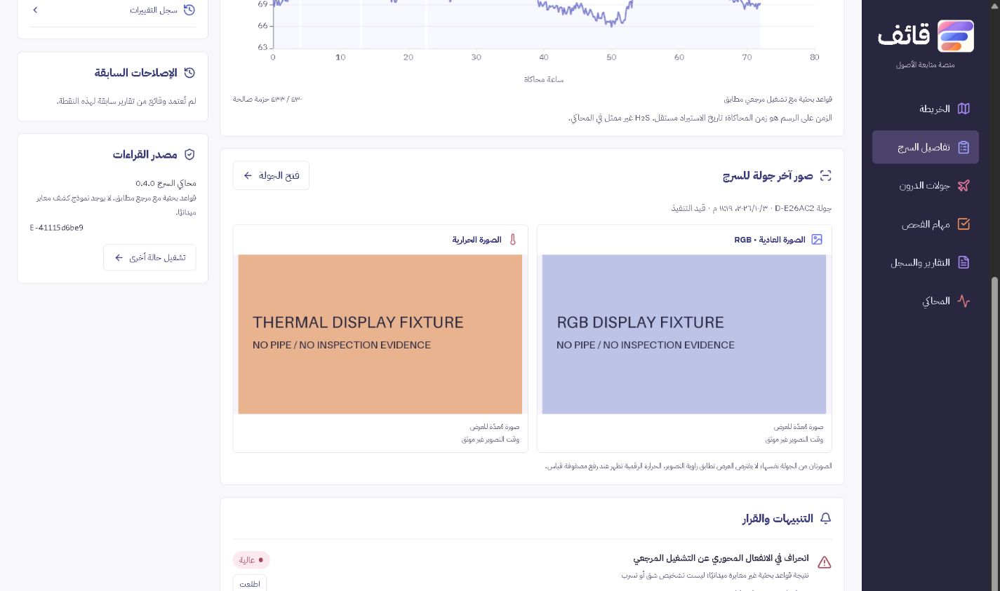

# تعديلات هوية قائف والواجهة

طُبقت التعديلات في النسخة المحلية: http://127.0.0.1:8765

| المطلوب | النتيجة |
|---|---|
| الشعار الجديد | الصورة الأصلية داخل إطار SVG يعرض الشعار دون المساحة البيضاء المحيطة؛ لا تغيير في بكسلات الصورة |
| الألوان الخمسة | #F280A4، #D57B7D، #FA965A، #A98CF6، #6772E8؛ درجات أغمق للنصوص والأزرار لتحسين القراءة |
| خريطة بأسلوب المترو | خطوط ملونة ومحطات ومفتاح خريطة ورسوم منشآت؛ اختيار الخط يفتح مخططه التفصيلي |
| عدد الأسرجة لكل خط | محسوب من الأسرجة المرتبطة به في قاعدة البيانات؛ العدد المقترح منفصل |
| نقاط كل 31 مترًا | افتراض تخطيطي على طول منشور أو طول يدخله المستخدم؛ عرض 20 نقطة في النافذة مع التنقل؛ لا تنشئ أجهزة أو قراءات |
| أولويات اليوم | تبويب بجانب دليل الأصول يجمع التنبيهات المفتوحة والجودة المتدهورة حسب السرج، ويفتح سجله |
| الأيقونات | قياس محوري بلونين، قياس محيطي، ميزان حرارة، وسحابة مطر للبلل؛ ألوان مختلفة لأقسام التنقل |
| صور الدرون للحالة | RGB والحرارية معًا في صفحة السرج والجولة، مع خانة فارغة واضحة عند غياب نوع؛ المقارنة السابقة من النوع نفسه |
| جميع خطوط النفط في السعودية | توسع الدليل إلى 8 مسارات موثقة أو تجريبية، منها التابلاين التاريخي؛ الحصر الكامل ما زال يحتاج سجل خطوط أو GIS من المالك |

31 مترًا افتراض من طلب التصميم، وليس نطاق كشف أثبته المحاكي. عدد النقاط المقترحة لا يمثل تركيبًا فعليًا. AB-4 يستخدم 42 كم للجزء البري السعودي في التخطيط؛ التابلاين المتوقف مستبعد.

المصادر مدرجة داخل تفاصيل كل مسار. من أمثلتها [خريطة أرامكو الرئيسية](https://www.aramco.com/-/media/publications/corporate-reports/bonds/2024-gmtn-prospectus.pdf#page=133)، [وصف AB-4](https://www.aramco.com/en/news-media/news/2018/bapco-new-pipeline)، و[التابلاين التاريخي](https://www.aramco.com/en/news-media/elements-magazine/2021/the-tapline-a-legacy-of-triumph). الرسم ليس إحداثيات تشغيلية، ولا تحقق هذه المصادر القديمة حالة تشغيل كل خط اليوم.

نجحت 17 اختبارات للخلفية، واختبارات حساب العدد وحدود آخر مقطع والتصفح، والبناء النهائي لـ React/TypeScript. جُرب اختيار الخط والأولويات والصورة التي ستُحلل، وفُحصت الصفحات السبع عند عرض 360 بكسل دون تجاوز أفقي للصفحة. الخريطة نفسها قابلة للتمرير داخليًا على الجوال. نسبة تباين النصوص الرئيسية لا تقل عن 4.5:1.

بقيت كل سجلاتك السابقة دون تغيير، وتحقق تطابق 87 ملفًا من المحاكي مع النسخة المجمدة. اختبار الصورتين أجري في قاعدة منفصلة بصور تحمل نصًا واضحًا بأنها ليست صور أنابيب أو دليل فحص. لا يتضمن هذا التعديل اختبار كاميرا فعلية أو تحليل Gemini حيًا.

ملف verification.json يسجل نتائج التحقق، وresponsive.json يسجل أحجام الصفحات. الأرشيف المرفق نسخة المصدر والواجهة المبنية، دون بيانات المستخدم أو ملف .env أو كلمات المرور.
