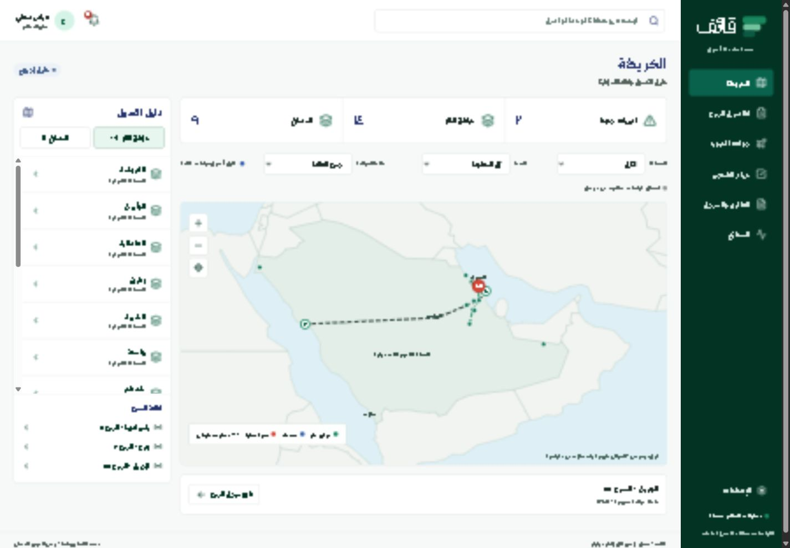
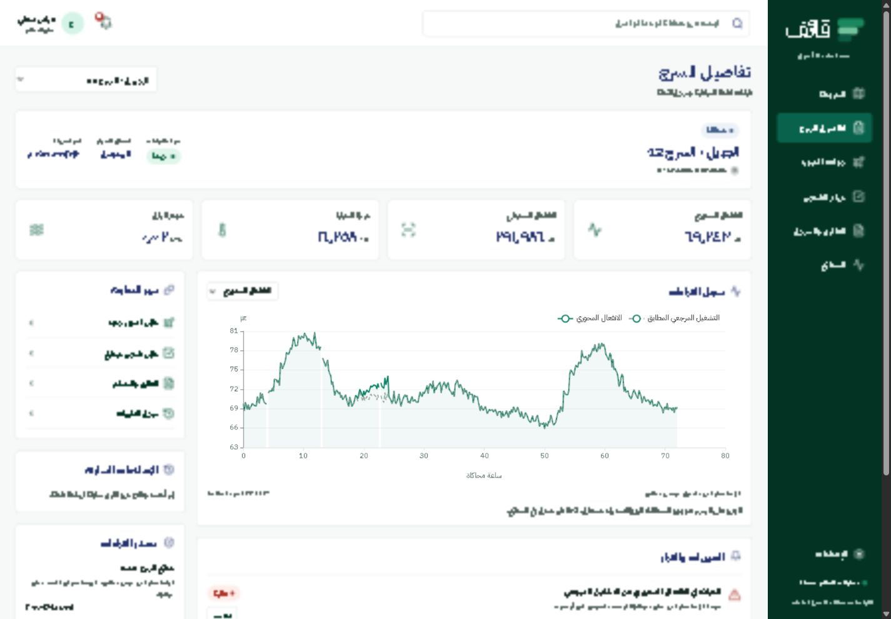
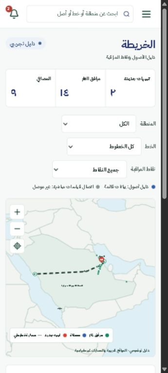
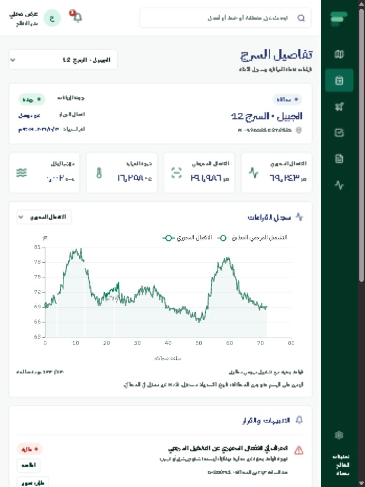

# تنفيذ قائف · 3 أكتوبر 2026

تم بناء نسخة أولى تعمل محليًا في `C:\Users\omaro\OneDrive\Desktop\projects\Qaif`، مستندة إلى الواجهات العربية المرسلة. المشروع الأصلي للمحاكي محفوظ، ونسخة 0.4.0 موجودة في المشروع الجديد مع بصمات تحقق.

## ما يمكن تجربته الآن

| الوظيفة | التنفيذ الحالي |
|---|---|
| الخريطة والدليل | 14 مرفق غاز و9 مصافٍ بدليل توضيحي، مسارات تقريبية، بحث عام وتصفية المنطقة والخط ونقاط التنبيه |
| تفاصيل السرج | قراءات محفوظة، رسوم أربع قنوات، مصدر التشغيل وجمع الحزم، ومقارنة التشغيل بالمرجع البحثي المطابق |
| تحليل القراءات | قواعد معلنة للانفعال والبلل، فصل تغير الاقتران وانقطاع الحزم وثبات الحساس؛ ليست نموذجًا مدربًا أو معايرًا |
| جولات الدرون | طلب، جدولة، بدء، رفع RGB/حراري، مقارنة زيارة سابقة، مراجعة، إكمال، إلغاء وإعادة تصوير |
| مراجعة الصور | مراجعة بشرية تعمل؛ تكامل Gemini جاهز للاختبار بعد المفتاح، مع حفظ الفشل والتحقق من بنية النتائج والصناديق |
| قياسات الحرارة | استيراد مصفوفة درجات حرارة NPY مع وحدة ومنطقة أنبوب وحساب Tmax/الوسيط/الفرق؛ الصور الملونة نوعية |
| التقارير السابقة | استخراج نص PDF وصفحاته، اعتماد اقتباس موثق وربطه بسجل السرج والتقرير الجديد |
| أولوية التركيب | قواعد لحام/بلل/إصلاح سابق مع اعتماد/رفض بشري؛ الوقائع المعتمدة تحدث سابقة الإصلاح |
| التنبيهات | حفظ المصدر والتوقيت وشدة المراجعة، الاطلاع، طلب تصوير مرتبط، تحديثات WebSocket |
| الفحص والقرار | تعيين، زيارة، نتيجة وNDT، قرار وإغلاق، ربط التقرير بالمهمة وسجل التغييرات |
| التقارير | مسودة HTML عربية قابلة للطباعة/الحفظ PDF، وتصدير JSON، مع المصادر والقيود وحالة مراجعة المفتش |
| التشغيل | دخول وأدوار محفوظة، دخول عرض محلي، SQLite وأدلة محمية، تشغيل/إيقاف بسكريبت، حزمة المصدر وDockerfile |

## التحقق المنفذ

- نجح بناء React/TypeScript النهائي.
- نجحت **16** اختبارات خلفية وعقد المزود، منها رحلة حتى الإغلاق، حفظ بعد إعادة تشغيل، أدوار وجلسات، رفض تواريخ/صور/NPY غير صالحة، رفض تجاوز حجم الرفع، attribution PDF، فشل التحليل بلا نتيجة مختلقة، HTML escaping، تحديث WebSocket وإيقاف التشغيل المتدرج.
- نجحت **54** اختبارات المحاكي في النسخة المنسوخة.
- تطابقت بصمات **87** ملفات من النسخة الثابتة؛ طابقت **86** ملفات موجودة في تخطيط المشروع الأصلي النسخة المصدرة. الملف الآخر موجود في الحزمة الثابتة فقط وفق تخطيط التصدير. التقرير التفصيلي في `integrity.json` بالحزمة المسلمة.
- جُربت الرحلة في المتصفح: تنبيه انفعال محسوب ← طلب تصوير ← جدولة وبدء ← رفع ملف اختبار معلن ← مراجعة بشرية ← تقرير ← تعيين وزيارة ونتيجة ← قرار وإغلاق. ثم أعيد تشغيل الخادم وظهرت السجلات السابقة.
- جُرب التشغيل المتدرج الحقيقي في التطبيق: بدأت شاشة القراءات بـ12 حزمة، وانتهت بـ433 (430 صالحة)، وأضيف التنبيه المحسوب عبر أحداث النظام.
- جُربت مقاسات 1440 و768 و360. لا يوجد تمرير أفقي في الصفحات الست عند 360، ونُفذت قائمة التنقل على الجوال. فحص console النهائي لم يظهر أخطاء أو تحذيرات.
- جُرب سكريبت بدء وإيقاف الخادم المخفي، مع تحقق هوية العملية قبل إيقافها.

اختبارات المزود تستخدم MockTransport ولا تثبت جودة تحليل صور حقيقية. لا تمثل نتائج الحالات الخمس مقياس دقة ميدانيًا؛ المرجع من التحكم المطابق في نفس تجربة المحاكاة.

## ما لم يتحقق بعد

**المفتاح والكاميرا:** المستخدم سيوفر مفتاح Gemini لاحقًا. لم تُرسل صورة فعلية إلى المزود ولم تختبر جودة تفسير الشقوق والطلاء. الكاميرا الحرارية لم تصل بعد ولم تُعرف واجهتها. أداة edge الحالية تستعرض الأجهزة وتنقل ملفًا مصدّرًا؛ لا تدعي استقبال بث أو فك درجات حرارة خاصة بالكاميرا.

**التدريب والاعتماد:** الكشف الحالي قواعد بحثية، ولا يوجد نموذج مدرب مستقل أو معايرة ميدانية أو تقدير عمق شق أو تسرب مثبت. إدخال جهاز بلا مرجع معتمد يجري فحوص جودة فقط. يجب إعداد وتقييم نموذج متوقع للقراءات عندما تتوفر بيانات مرجعية قابلة للتقسيم الصحيح.

**النشر:** لم ينشر التطبيق سحابيًا. Docker غير مثبت فلم يُختبر بناؤه. مراجعة إعداد HTTPS والتخزين والصلاحيات والحمل مطلوبة قبل إتاحة الخدمة خارج الجهاز.

**سيناريو الفيديو:** توجد إشارة حرارية يدوية معلنة المصدر لتجهيز تسلسل الفيديو. ليست إضافة فيزيائية إلى المحاكي ولا استنتاجًا حراريًا من الصورة. إذا أردنا تنبيهًا مشتقًا من نموذج حرارة خارجي، فذلك يحتاج امتدادًا للمحاكي واختبارات فيزيائية منفصلة قبل الادعاء به.

## لقطات التحقق

التشغيل والخطوات العملية في `README.md`.

